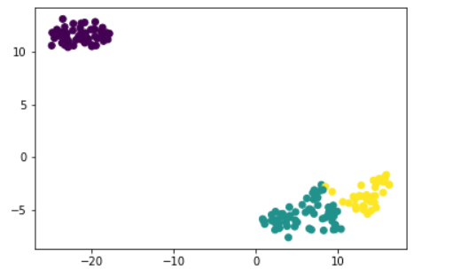

# sklearn-practice-homowork
人工智能导论作业

### 作业要求
1. 回归（Air quality dataset）：线性回归；
2. 分类（BLE&RSSI dataset）：SVM、决策树、随机森林；
3. 聚类（BLE&RSSI dataset）：DBScan、kmeans、GMM、层次聚类算法
其中聚类算法要求以t-SNE实现结果可视化

### 数据集

- [Air quality](https://archive.ics.uci.edu/ml/datasets/Air+quality)
属性信息

| 属性 | 内容|
| ------ | ------ | 
|  Date	(DD/MM/YYYY) | 日期 |
|  Time 	(HH.MM.SS) | 时间 |
|  True hourly averaged concentration CO in mg/m^3 (reference analyzer) | 每小时一氧化碳浓度 | 
|  PT08.S1 (tin oxide) hourly averaged sensor response (nominally CO targeted)	| 每小时传感器响应 |
| True hourly averaged overall Non Metanic HydroCarbons concentration in microg/m^3 (reference analyzer) |  每小时Non Metanic HydroCarbons浓度 | 
| True hourly averaged Benzene concentration in microg/m^3 (reference analyzer) | 每小时苯的浓度 | 
| PT08.S2 (titania) hourly averaged sensor response (nominally NMHC targeted) | 每小时针对 NMHC的浓度 |	
| True hourly averaged NOx concentration in ppb (reference analyzer) | 每小时一氧化氮类浓度 |
| PT08.S3 (tungsten oxide) hourly averaged sensor response (nominally NOx targeted) | 每小时针对一氧化氮类的反应 |
| True hourly averaged NO2 concentration in microg/m^3 (reference analyzer)	| 每小时针对二氧化氮的浓度 |
|  PT08.S4 (tungsten oxide) hourly averaged sensor response (nominally NO2 targeted) | 针对二氧化氮的反应 |
|  PT08.S5 (indium oxide) hourly averaged sensor response (nominally O3 targeted) | 针对臭氧的反应 | 
| Temperature in °C | 温度 | 	
| Relative Humidity (%) | 相对湿度 | 
| AH Absolute Humidity | 绝对湿度 | 

- [BLE dataset](https://archive.ics.uci.edu/ml/datasets/BLE+RSSI+Dataset+for+Indoor+localization+and+Navigation)

数据集包括两部分，一部分是已经标注好的是数据，一部分是未标注的数据
数据集共有15个属性值

对于分类好的数据，属性包括 location timestamp 和 13个iBeacons.

对于未分类数据, 属性包括 13个iBeacons 和 timestamp

### 实验过程

#### 1. 回归

##### 数据预处理

*在实验过程发现, csv中数据格式混乱, 以 execel中数据为准.*

首先, 根据这个数据集中的数据分布

其中NMHC(GT) 和 NO2(GT) NOx(GT) 三个属性下的缺失值过多, 因此删去这三列

对于剩下的属性, 将含有缺失值的样本也做删除处理.

缺失值处理后的数据集

##### 训练结果

对于这个数据集, 不同时间下的分布也是不同的, 因此我们提取其中一个时间戳下的所有属性. 

在做回归时, 将最后一个属性作为label, 通过其他属性去预测这个属性的值,最后的结果如下

#### 2. 分类

##### 数据预处理

首先是数据集的展示, labelled 和 unlabelled 数据集具有相同的分布

可以看出, 在这个数据集中, 对于各个属性, 缺失值均占该属性的百分之八十以上.

但考虑到, 在这个数据集中, 缺失部分也是各个属性的特征之一. 因此先不考虑处理.

- SVM
  
在 scikit-learn中, SVM分类 SVC内置的核函数共有四种, 分别是 `线性核函数, 多项式核函数, 高斯核函数, Sigmoid 核函数` 

对于我们的数据集, 显然是线性不可分的, 因此, 不考虑线性核函数, 由于 多项式核函数和Sigmoid 核函数 需要调的参数比较多, 因此我们采用 高斯核函数

这个数据集虽然缺省值较多, 但是噪声数据很少, 因此在惩罚系数较高时有较好表现.

在惩罚系数为20000的情况下, 分类准确率为 30%. 

考虑到分类标签共有 104 种, 而且每类下样本数较少, 因此最后的分类准确率较低

- 决策树

决策树在实现的时候使用的是默认的参数, sklearn 中 默认的特征选择标准是基尼系数

分类准确率为: 25%

- 随机森林

sklearn 中 RF 的参数分为两部分, 一部分是 Bagging框架的参数, 另外一个是决策树参数

对于 Bagging 框架参数

其中 n_estimators 代表的是弱学习器的最大迭代次数, 为100
oob_score 和 criterion 都选择默认的参数

对于决策树参数, 选其默认值

分类准确率为: 28%

#### 3. 聚类

*由于所给数据集的分类属性太多, 而且缺失值较多, 不利于可视化实验结果, 因此我采用了 sklearn库中 iris 数据集*

通过T-SNE方法将数据集映射到二维空间, 再分别根据聚类结果进行可视化

对于 T-SNE 有个很重要的参数是learning_rate 它决定了最后的数据的离散程度, 这个值越小, 那么数据分布地越分散, 反之, 数据分布的越密集
, 我这里选择 learning_rate=120

###### 原数据分类可视化结果

- KMeans

对于n_clusters 参数, 由于我们已知数据集的target的数量, 因此, 这个参数的选取及为 target 的数量.
其余参数, 除了 random_state外, 均采用默认值

###### 可视化结果

- DBSCAN

DBSCAN 中参数主要是 eps 和 min_samples 

eps 默认参数是0.5, 对于eps 的选取, 如果选的值过大, 那么更多的点会落在核心对象的$\epsilon$-邻域内, 这个时候类别数应该会减少, 反之, 类别数会增加, 但是对于eps的选择, 我没找到很好的方法, 我尝试了几个不同的值, 最后 eps 选了0.8

对于 min_samples 即样本点要成为核心对象所需要的$\epsilon$-邻域的样本阈值, 在给定 eps 的情况下, min_samples 越大, 核心对象会越少, min_samples 过小, 则会产生大量的核心对象, 可能会导致类别数过少, 这里, min_samples=40

###### 可视化结果

- 层次聚类

还是只设置了分类簇的数量, 通过 n_clusters 参数, 其余参数均选默认值

###### 可视化结果

- 高斯混合模型

混合高斯模型个数, 设为数据集的target的数量. 其余参数均为默认值
从可视化结果中可看出, GMM于原分类最为接近

##### 可视化结果

